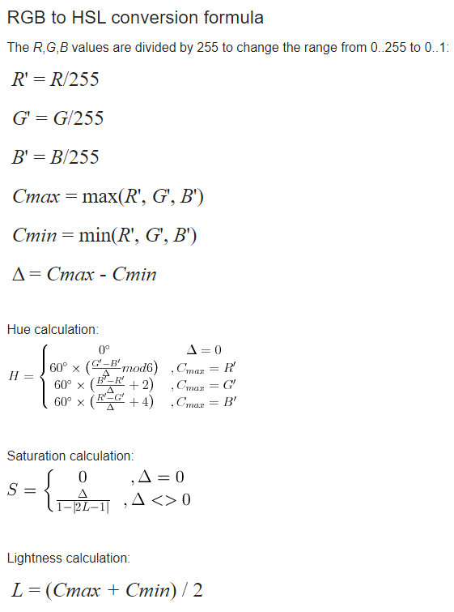

### 2024-10-13

你要明白，活著的時候，沒幾個人在意你。你死了以後，也沒幾個人記得你。你要知道，**除了生病以外，你所感受到的痛苦，都是你的認知帶給你的，並非是真實的存在。**
你需要在乎的，無非三件事:我的錢，我的健康，我內心的平靜，不要相信壓力會轉化成動力，長期的壓力只會轉化成你的病歷。
保持快樂的三大秘訣，無所謂，沒必要，不至於。不要對每件事過度自省，該吃吃，該喝喝，笑一笑，然後翻篇，鬆弛感就是你給自己最好的保養品

### 2024-04-20

staycation

### 2024-09-19

沉没成本不参与重大决策

### 2024-03-19

勾稽关系：会计账簿和报表中有关指标、数字之间所存在的具有必然性并可据以相互查考以及核对的关系

### 2024-01-14

> **耳虫**
非自愿的音乐意象（Involuntary Musical Imagery），是指某段音乐在脑中不断重复的现象，科学家发现很多音乐都能够形成这种效果。
>

### 2023-08-20

美林时钟


### 2022-10-2

https://m.bilibili.com/video/BV1pg411Y7KB

> 看多了离婚财产分割案件，你就会明白，婚姻的本质绝不是爱情制度，而是财产制度。
>
>
> 受各种文学和影视宣传的迷惑，大家往往忽略了这一点。
>
> 很多人对婚姻关系的认识都过于小清新，总觉得婚姻关系的第一性是爱情。
>
> 许多人婚姻关系之所以容易破裂，就是因为双方赋予了婚姻其不应承担的美好想象。
>
> 他们忘了，婚姻是伴随着私有制而产生的，家庭最初就是私有制下的社会基本生产单元。
>
> 所以婚姻的本质、婚姻的第一性一定是财产关系，而不是恋爱关系。
>
> 财产关系太过赤裸裸，于是以爱情为遮羞。
>
> 折腾久了，大家都信以为真。
>
> 关于婚姻和爱情，一直有个致命提问啊，如果是真爱，如果至死不渝，为何还要一纸结婚证来捆绑呢？
>
> 因为婚姻要固定的不是爱情，而是一个社会基本生产单元，固定一份财产关系。
>
> 大家去看一些有母系氏族文化遗存的地方，比如以前的摩梭男女，走婚而非嫁娶，感情反而更纯粹一些，那就是因为坐落在大山沟里啊，资源有限，生产力落后，向私有制迈进的速度没跟上大部队啊，没出现婚姻制度啊，当然，现在也发生变化了。
>
> 为何现在离婚率越来越高啊？
>
> 感情问题不是第一位的，根本原因在于婚姻寄生的财产制度正在逐渐瓦解。
>
> 很多人说老一辈人夫妻之间感情要比现在的好，其实根本不是，我们总是喜欢把现实中难以满足的愿望向过去、向国外做虚假的投射想象。
>
> 老一辈夫妻看上去关系牢靠一些，只不过是因为在以前，家庭是必须的社会基本生产单元，家庭成员相互扶持才能共担风雨，换言之，谁也离不开谁，一个人难以生存。
>
> 可是几十年来，中国迅速从农业社会向工业社会转变，除非出现疫情封控那样的系统性拉闸，个人完全可以独立生产生活，独立对抗风险的能力大大提高，也就不再需要共同扶持了。
>
> 其实你想想，大家族这个东西是怎么一点点消亡的，一样的道理。
>
> 婚姻家庭最根本的功能被削弱了，于是表现出来的就是男女越来越个人主义，只要相处的不爽了就闹离婚。
>
> 随着生产力的发展，婚姻功能会进一步削弱。
>
> 婚姻的消亡是必然的。
>
> 时间早晚而已。
>

### 2021-10-12

幂律分布，引爆点，20%人掌握80%财富

### 2021-10-08

> 导致上瘾的原因：
敏化反应（对能产生某种刺激的相关信息更敏感）；
脱敏反应（重复兴奋的行为时，大脑会产生耐受性）；
脑前额叶功能退化（人们控制冲动和预知后果的能力减弱）；
要做到
1，制定目标，让大脑有的放矢 （小目标即可）
2，不断挑战，培养积极心态（小挑战，不断升级）
 3，发现奖赏，重拾生活中的小确幸 （重视反馈）
>

### 2021-03-02

缘悭

### 2021-01-14

Kadane's Algorithm to Maximum Sum Subarray Problem

```rust
use std::cmp;
// leetcode.com/problems/maximum-subarray/submissions/
fn main () {
    let nums = vec![2, 1, -2, 3, 2];
    let mut current_max:i32 = nums[0];
    let mut global_max:i32 = nums[0];

    for index in 1..nums.len() {
        current_max = cmp::max(nums[index], current_max + nums[index]);
        if current_max > global_max {
            global_max = current_max
        }
    }
    println!("{}", global_max); // 6
}
```

### 2021-01-11

Floyd 's totourise and hare algorithm

### 2020-12-21

不置可否：不说对，也不说不对

### 2020-11-30

凡尔赛文学: 凡尔赛文案讲究先抑后扬，自问自答，要不经意的炫耀自己的想要炫耀的东西，然后文字还要显得自己很苦恼很不高兴的样子，例如社交平台的装逼文案。

### 2020-09-22



### 2020-09-21

生前合照，生后合照，“铲”后抑郁

### 2020-01-31

天乳运动

### 2020-01-03

判断一个数是否偶数，将这个数与1进行与运算

```jsx
 1 & 1 => 1
 2 & 1 => 0
-6 & 1 => 0
-5 & 1 => 1

 0 & 1 => 1
```

将一个数除以 2，右移 1 位(奇数结果向下取整)

```jsx
-1 >> 1 => -1
-6 >> 1 => -3
 2 >> 1 => 1
2.2 >> 1 => 1
 3 >> 1 => 1
 4 >> 1 => 2
```

### 2019-12-31

鲁棒性（英语：robustness），也称稳健性，指事物可以抵御外部应力和影响并维持原有状态的自身性质。

### 2019-11-21

出恭=上厕所

### 2019-12-03

深度作用选择器[https://vue-loader.vuejs.org/zh/guide/scoped-css.html#深度作用选择器](https://vue-loader.vuejs.org/zh/guide/scoped-css.html#%E6%B7%B1%E5%BA%A6%E4%BD%9C%E7%94%A8%E9%80%89%E6%8B%A9%E5%99%A8)

```css
.invalid /deep/ .el-input__inner {
  border-color: red;
}
```

```html
<el-table-column
  label="信用额度">
  <template slot-scope="scope">
    <el-input
      v-model="creditAmount[scope.row.id].credit"
      :class="{ invalid: creditAmount[scope.row.id].invalid }"
      size="mini"
      @input="changeCreditAmount(scope.row.id)"
    />
  </template>
</el-table-column>
```

### 2019-10-17

小程序点击物理返回键，始终返回上一页

eg: 支付页成功支付→订单详情→订单列表

想在订单详情返回订单列表，点击返回键始终返回支付页

1. 自定义订单详情 navbar，点击 navbar 成功导航至订单列表，但点击返回键依然返回支付页。

### 2019-10-07

小程序不存储响应头设置的 Set-Cookie

### 2019-09-25

发现 Chrome 一个 bug，不会高亮反引号（backticks）" ` "

[https://stackoverflow.com/questions/40864026/chrome-dev-tools-issue-with-es6-string-literals-typescript](https://stackoverflow.com/questions/40864026/chrome-dev-tools-issue-with-es6-string-literals-typescript)

### 2019-08-14

svn 忽略 node_modules（注意最后还有一个点号）

```bash
svn propset svn:global-ignores "node_modules" .
```

//  jQuery when()方法异步任务同步执行

```jsx
// 异步
$.when(updateCity("change", res.data.city.id, res.data.country.id))
 .done(function() {
    $('#city').val(res.data.city.id)

    $.when(updateDistrict()).done(function() {
        $('#district').val(res.data.country.id)
    })
})
```

### 2019-05-30

- 查看网卡驱动名称：lsmod | grep Ethernet 或 lspci -vvv
- 从 kernel 移除模块：rmmod，例如：rmmod r8168
- 从 kernel 加载模块: modprobe ，例如：modprobe r8168
- 查看上一次开机 log：journalctl -k -b-1
- 查看开机信息：dmesg
- 查看系统信息：inxi -F
- 命令行连接网络工具：nmtui 和 nmcli